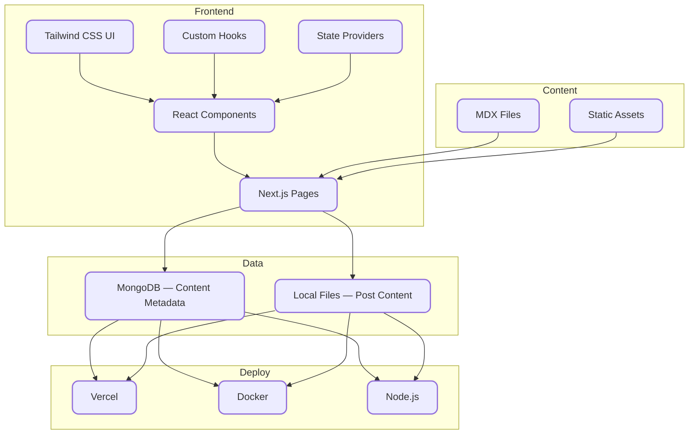

<h2 align="center">
🚀 gkBlog &middot; A Modern Blog Starter
</h2>

<p align="center">
A performant, full-stack blog starter kit built with <b>Next.js 15</b>, <b>MDX</b>, and <b>Tailwind CSS</b> — forked from <a href="https://www.enji.dev/">enji.dev</a> and heavily customized.
</p>

<p align="center">
  
</p>

<div align="center">

✨ Live Demo: <a href="https://www.qladgk.com">www.qladgk.com</a> ✨

[](https://vercel.com/new/clone?utm_source=busiyi&utm_campaign=oss&repository-url=https%3A%2F%2Fgithub.com%2FqlAD%2FgkBlog&env=DATABASE_URL%2CSALT_IP_ADDRESS%2CNEXT_PUBLIC_BAIDU_TONGJI%2CNEXT_PUBLIC_GOOGLE_ID)

</div>

<div align="center">
  
  
  
  
</div>

---

## ✨ Features

- ⚡ **Next.js 15 + React 19** — blazing fast performance with the latest React
- 📝 **MDX-first** — write posts in Markdown, embed React components anywhere
- 🎨 **Tailwind CSS** — fully responsive, class-based dark mode, accent color system
- 📊 **Built-in analytics** — page views, shares, and emoji reactions (CLAP/THINK/AMAZED)
- 🔍 **SEO optimized** — auto-generated sitemap, RSS feed, dynamic OG images via `@vercel/og`
- 📖 **Series support** — group posts into series with navigation and custom metadata
- 💬 **Comments** — Twikoo integration for privacy-friendly commenting
- 🐳 **Docker ready** — one-command deploy with blue-green zero-downtime updates
- 🌍 **i18n ready** — bilingual content support out of the box
- 🎬 **Framer Motion** — smooth page transitions and animations

## 🆚 Why gkBlog?

| | gkBlog | Hexo / Hugo | WordPress |
|---|---|---|---|
| **Framework** | Next.js 15 + React | Static generator | PHP |
| **Content** | MDX (Markdown + React) | Markdown | WYSIWYG |
| **Hosting** | Vercel (free) | GitHub Pages | VPS / managed |
| **Customization** | Full React component system | Theme templating | Plugin ecosystem |
| **Performance** | ⚡ SSG + ISR | ⚡ Static | 🐢 Server-rendered |
| **DX** | TypeScript, hot reload | CLI, YAML config | Admin panel |
| **Best for** | Devs who want full control | Simple blogs | Non-technical users |

## 🛠️ Tech Stack

- **Frontend**: Next.js 15, React 19, TypeScript
- **Styling**: Tailwind CSS 3, `tailwindcss-accent`, Framer Motion
- **Content**: MDX with custom remark/rehype plugins (KaTeX math, Prism syntax highlighting)
- **Database**: MongoDB (free tier) via Prisma ORM — stores view/share/reaction metadata
- **Deployment**: Vercel, Docker, or Node.js 22+



## 🚀 Quick Start

> **Prerequisites**: [pnpm](https://pnpm.io/installation) (recommended), Node.js 22+

### 1. Fork & Clone

```bash
git clone https://github.com/<your-username>/gkBlog.git
cd gkBlog
```

### 2. Configure Environment

```bash
cp ./apps/gkBlog/.env.example ./apps/gkBlog/.env.local
```

Edit `.env.local`:

```yaml
# Required: MongoDB connection string (free tier works)
DATABASE_URL = mongodb+srv://<user>:<password>@<cluster>/<db>?retryWrites=true&w=majority

# Required: any random string for session hashing
SALT_IP_ADDRESS = your-random-secret

# Optional: analytics integrations
NEXT_PUBLIC_BAIDU_TONGJI = xxxxxxxxxxxxxx    # Baidu Analytics
NEXT_PUBLIC_GOOGLE_ID = xxxxxxxxxxxxxx        # Google Analytics
NEXT_PUBLIC_CLARITY_TAG_ID = xxxxxxxxxxxxxx   # Microsoft Clarity
NEXT_PUBLIC_TWIKOO_ENVID = xxxxxxxxxxxxxx     # Twikoo Comments
```

### 3. Install & Run

```bash
pnpm install
pnpm dev
```

Your blog is running at `http://localhost:3000`! 🎉

### 4. Create Your First Post

```bash
mkdir -p apps/gkBlog/src/pages/blog/my-first-post
```

Create `apps/gkBlog/src/pages/blog/my-first-post/index.mdx`:

```mdx
---
title: Hello World
description: "My first blog post with gkBlog"
date: "2024-01-01"
lang: en
tags:
  - nextjs
  - blog
category: Tech
cover: https://your-cdn.com/cover-image.png
---

## Welcome to my blog!

This is written in **Markdown** with full React component support.
```

### Post Frontmatter Reference

| Field | Type | Required | Description |
|---|---|---|---|
| `title` | string | ✅ | Post title |
| `description` | string | ✅ | SEO description & preview text |
| `date` | string | ✅ | Publication date (`YYYY-MM-DD`) |
| `lang` | `zh` \| `en` | ✅ | Language |
| `tags` | string[] | — | Tag list |
| `category` | string | — | Category name |
| `cover` | string | — | Cover image URL (CDN recommended) |
| `series` | string | — | Series name for grouping posts |
| `seriesOrder` | number | — | Order within the series |

## 🚢 Deployment

### Vercel (Recommended — Free)

[](https://vercel.com/new/clone?repository-url=https%3A%2F%2Fgithub.com%2FqlAD%2FgkBlog&env=DATABASE_URL,SALT_IP_ADDRESS)

One click. Auto-deploys on every push to `main`.

### Docker

```bash
docker compose build
docker compose up -d
```

Blue-green deploy for zero downtime:

```bash
docker compose -f docker-compose-blue.yml pull
docker compose -f docker-compose-blue.yml up -d
# Verify blue is healthy, then switch traffic
docker compose -f docker-compose-green.yml pause
```

### Node.js

```bash
pnpm install
pnpm build
pnpm start
```

---

## 📝 Content Authoring

### Post Frontmatter

```yaml
---
title: Building a Static Blog with Next.js
description: "A complete guide to building a static blog with Next.js, MDX, and Tailwind CSS."
date: "2024-10-18"
lang: zh
tags:
  - nextjs
  - tutorial
category: Tech Notes
cover: images/20250422153424876.png
---
```

### Image Hosting

Use a CDN (e.g., Alibaba Cloud OSS) with PicGo for one-click uploads. All images in `cover` fields should point to CDN URLs.

### Diagram & Design Tools

- **Mermaid diagrams**: [mermaid.live](https://mermaid.live/edit)
- **Cover generator**: [picprose.pixpark.net](https://picprose.pixpark.net/zh)
- **Hand-drawn diagrams**: [excalidraw.com](https://excalidraw.com/)
- **Image compression**: [picsmaller.com](https://picsmaller.com/)

---

## 📂 Repositories

- **Primary**: [github.com/qlAD/gkBlog](https://github.com/qlAD/gkBlog)
- **Mirror (CN)**: [git.qladgk.com/qlAD/gkBlog](https://git.qladgk.com/qlad/gkBlog)
- **Mirror (Gitee)**: [gitee.com/qlAD/gkBlog](https://gitee.com/qlad/gkBlog)

---

## 🤝 Contributing

See [CONTRIBUTING.md](CONTRIBUTING.md) for setup instructions and guidelines.

**Contributors**

<a href="https://github.com/qlAD/gkBlog/graphs/contributors">
  
</a>

---

## 🌟 Star History

[](https://www.star-history.com/#qlAD/gkBlog&Date)

**If you find this project useful, please consider giving it a ⭐ — it helps others discover it!**

---

## 📜 License

[MIT License](LICENSE) — feel free to use, modify, and share.

---

## 🔑 Environment Variables Reference

| Variable | Description | How to Get |
|---|---|---|
| `DATABASE_URL` | MongoDB connection string | [MongoDB Atlas](https://www.mongodb.com/) (free tier) |
| `SALT_IP_ADDRESS` | Salt for session ID hashing | Any random string you choose |
| `NEXT_PUBLIC_BAIDU_TONGJI` | Baidu Analytics ID | [tongji.baidu.com](https://tongji.baidu.com/) |
| `NEXT_PUBLIC_GOOGLE_ID` | Google Analytics ID | [analytics.google.com](https://analytics.google.com/) |
| `NEXT_PUBLIC_CLARITY_TAG_ID` | Microsoft Clarity ID | [clarity.microsoft.com](https://clarity.microsoft.com/) |
| `NEXT_PUBLIC_TWIKOO_ENVID` | Twikoo Comment System Env ID | [twikoo.js.org](https://twikoo.js.org/) |
| `BAIDU_API_URL` | Baidu Search API URL | [ziyuan.baidu.com](https://ziyuan.baidu.com/) |
| `BING_API_KEY` | Bing IndexNow API Key | [bing.com/indexnow](https://www.bing.com/indexnow/getstarted/) |
| `ALIYUN_REGISTRY` | Alibaba Cloud Container Registry | [cr.console.aliyun.com](https://cr.console.aliyun.com/) |
| `DOCKER_USERNAME` | Docker registry username | Alibaba Cloud CR credentials |
| `DOCKER_PASSWORD` | Docker registry password | Alibaba Cloud CR credentials |
| `NEODB_ACCESS_TOKEN` | NeoDB Access Token | [neodb.social/developer](https://neodb.social/developer/) |

---

---

<h2 align="center">
🚀 @qlAD 乔 &middot; gkBlog 现代化博客网站主题
</h2>

<p align="center">
🌐 使用 Turborepo 和 pnpm 构建的博客网站，基于 <a href="https://www.enji.dev/">enji.dev</a> 主题二次开发
</p>

<div align="center">

✨在线预览：<https://www.qladgk.com> ✨

</div>

---

## 🛠️ 系统架构

gkBlog 系统采用现代化的全栈技术架构，具体如下：

- **前端**：使用 Next.js、React 和 TypeScript 构建用户界面，确保应用的高性能和开发效率。
- **样式**：采用 Tailwind CSS 框架，实现灵活且响应式的样式管理。
- **内容**：支持 MDX 格式，便于内容创作和富文本编辑。
- **数据库**：使用在线版 MongoDB 存储文章元数据，而文章内容则存储在本地项目目录中。
- **部署**：支持通过 Vercel 或 Node.js 环境进行部署，也可以生成 Docker 镜像。

> 📝 有关更多流程图见： [项目流程图](FlowChart.md)

---

## 💻 项目开发

首先，我建议[安装 pnpm](https://pnpm.io/installation)，因为它是此项目中使用的包管理器。

1. **Fork 本项目**，然后将其克隆到本地机器：

   ```bash
   git clone <your-fork>
   cd ./gkBlog
   ```

2. **准备好对 `.env.local` 文件进行配置**：

   ```bash
   cp ./apps/gkBlog/.env.example ./apps/gkBlog/.env.local
   ```

   ```yaml
   DATABASE_URL = your-database-connection-string
   SALT_IP_ADDRESS = super-secret
   NEXT_PUBLIC_BAIDU_TONGJI = xxxxxxxxxxxxxx
   NEXT_PUBLIC_GOOGLE_ID = xxxxxxxxxxxxxx
   NEXT_PUBLIC_CLARITY_TAG_ID = xxxxxxxxxxxxxx
   NEXT_PUBLIC_TWIKOO_ENVID = xxxxxxxxxxxxxx
   ```

   > 📝 对于 `DATABASE_URL`，请使用您的数据库连接字符串。我个人使用的是免费版的 [MongoDB](https://www.mongodb.com/)，你也可以在免费版中创建数据库，并在 `env.local` 中添加连接字符串。它看起来应该如下所示：
   >
   > ```
   > mongodb+srv://<username>:<password>@<cluster-url>/<database>?retryWrites=true&w=majority&appName=<app-name>
   > ```
   >
   > 🗝️ 至于 `SALT_IP_ADDRESS`，你可以随意填写一些你的密码。它的作用是用于加密数据库处理。

3. **配置完成后**，仍然在项目根目录下安装所需的依赖项：

   ```bash
   pnpm install
   ```

4. **最后，运行项目**：

   ```bash
   pnpm dev
   ```

现在，你的项目应该已经启动并顺利运行了！🎉

---

## 🚀 部署运行

- **支持 Vercel 一键部署（海外用户推荐）**

  [](https://vercel.com/new/clone?utm_source=busiyi&utm_campaign=oss&repository-url=https%3A%2F%2Fgithub.com%2FqlAD%2FgkBlog&env=DATABASE_URL%2CSALT_IP_ADDRESS%2CNEXT_PUBLIC_BAIDU_TONGJI%2CNEXT_PUBLIC_GOOGLE_ID)

- **使用 Docker 部署（国内服务器推荐）**

  ```bash
  docker compose build
  docker compose up -d
  ```

- **支持 Node.js 环境部署**

  ```bash
  pnpm install
  pnpm build
  pnpm start
  ```

---

## 📝 备忘录

### 🔄 网站更新

- **Vercel**：随着 GitHub 仓库的更新自动部署。
- **国内服务器**：采用 Docker 蓝绿部署，具体命令如下：
  假设当前运行的是 **Green:3000**，此时需要更新 **Blue:3001**

  ```bash
  docker compose -f docker-compose-blue.yml pull # 给 blue 容器拉取最新镜像
  docker compose -f docker-compose-blue.yml up -d # 运行 blue 容器
  ```

  然后检查 `ip:30001` 后无问题切换流量到 `3001`

  ```bash
  docker compose -f docker-compose-green.yml pause # 先停止 green 容器
  ```

  过一段时间后发现 Blue 无问题就可停止或删除 Green，反之恢复 Green 后切换流量。

### 📂 主仓库

- GitHub：[https://github.com/qlAD/gkBlog](https://github.com/qlAD/gkBlog)

#### 📑 备份仓库

- 自建 Git 服务器：[https://git.qladgk.com/qlAD/gkBlog](https://git.qladgk.com/qlad/gkBlog)
- 国内码云：[https://gitee.com/qlAD/gkBlog](https://gitee.com/qlad/gkBlog)

### 🌐 运行架构

- **国内**：阿里云 Docker 容器、ESA [https://www.qladgk.com](https://www.qladgk.com)
- **国外**：Vercel [https://gkblog.vercel.app](https://gkblog.vercel.app)

### ✏️ 内容创作

#### 文章 FrontMatter

```yaml
---
title: Next.js 静态博客搭建指南 - 从架构设计到部署上线
description: "详细解析如何使用 Next.js 搭建静态博客，包括技术选型对比(Hexo/Hugo/WordPress)、MDX 内容管理、Twikoo 评论系统集成和 Serverless 部署方案。"
date: "2024-10-18"
lang: zh
tags:
  - nextjs
  - 环境配置
category: 技术笔记
cover: images/20250422153424876.png
---
```

#### 🖼️ 图床工具

- 阿里云 OSS 自建图床，使用 PicGo 客户端上传图片。
- 或者使用阿里云官方提供工具 OSS-Browser [https://help.aliyun.com/zh/oss/developer-reference/use-ossbrowser](https://help.aliyun.com/zh/oss/developer-reference/use-ossbrowser)

#### 🎨 图片生成工具

- **Mermaid 流程图**：使用在线 Mermaid 生成工具：[https://mermaid.live/edit](https://mermaid.live/edit)
- **封面/缩略图**：在线图片生成器：[https://picprose.pixpark.net/zh](https://picprose.pixpark.net/zh) ，设计布局如下：

  

- **手绘风格图**：使用在线 excalidraw 绘图工具：[https://excalidraw.com/](https://excalidraw.com/)

#### 📸 图片处理

- 图片压缩工具：图小小 [https://picsmaller.com/](https://picsmaller.com/)

---

## 🤝 贡献

对于那些想要贡献代码的人，请参阅 [贡献指南](CONTRIBUTING.md)。

**贡献者名单**

<a href="https://github.com/qlAD/gkBlog/graphs/contributors">
  
</a>

---

## 🌟 Star 历史

[](https://www.star-history.com/#qlAD/gkBlog&Date)

---

## 📜 License

本仓库遵循 [MIT License](LICENSE) 开源协议，请在使用前仔细阅读，欢迎您的使用和贡献。
